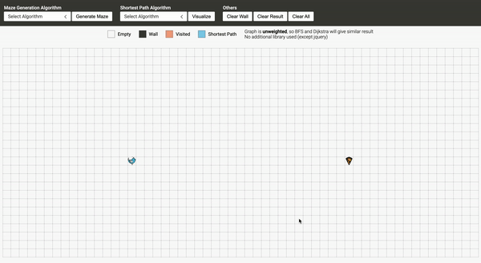
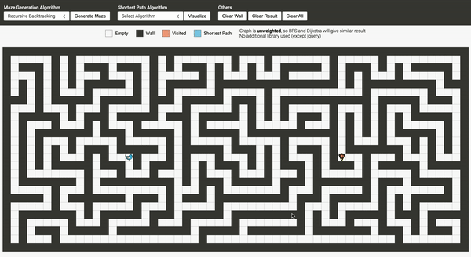

<h1 align="center">
	Graph Visualizer
</h1>

	
	

## About Graph Visualizer
Great way to visualise graph algorithms such as Maze Generator and Shortest Path in 2D grid. Try to play with it <a href="https://philip0014.github.io/graph-visualizer/">here</a>.

	
	 
	<i>Recursive Backtracking</i>

	
	 
	<i>A* (Euclidean)</i>

## Features
#### Maze Generator
<ul>
	<li>Recursive Backtracking</li>
	<li>Kruskal</li>
</ul>

#### Shortest Path
<ul>
	<li>Breadth-first Search</li>
	<li>Dijkstra</li>
	<li>A* (Euclidean)</li>
	<li>A* (Manhattan)</li>
</ul>

## Disclaimer
<ul>
    <li>Graph is <b>unweighted</b>, BFS and Dijkstra will give similar result</li>
	<li>I don't use any library (except jquery) to create this website</li>
</ul>

## License
All code provided are under the [MIT License](http://opensource.org/licenses/MIT).

Copyright © 2021 Philip Andreas
